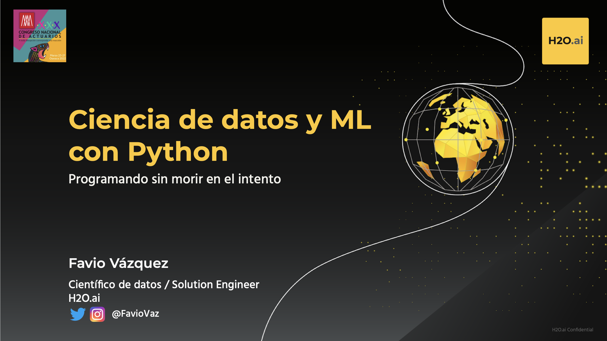

# Ciencia de datos y Machine Learning con Python

Código y archivos para el taller de Ciencia de Datos y ML con Python del XXX Congreso Nacional de Actuarios.

- [Slides](https://github.com/FavioVazquez/ama-dspy-2022/blob/main/Slides%20-%20Ciencia%20de%20datos%20y%20ML%20con%20Python%20-%20Favio%20Vázquez.pdf)
- [Introducción a Python](https://github.com/FavioVazquez/ama-dspy-2022/blob/main/notebooks/Intro_Python.ipynb)
- [Caso de estudio: Churn](https://github.com/FavioVazquez/ama-dspy-2022/blob/main/notebooks/Predicción%20de%20Churn.ipynb)
- [Caso de estudio: Cargos de seguros](https://github.com/FavioVazquez/ama-dspy-2022/blob/main/notebooks/Predicción%20de%20Cargos%20de%20seguros.ipynb)
